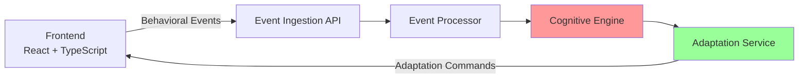

# 🧠 Adaptive Cognitive-Aware Audio Reading Platform
## MSc Research Project

A **research-grade full-stack web application** that automatically adapts audio content delivery based on real-time behavioral cognitive indicators for blind and visually impaired users.

---

## 🎯 Research Innovation: The Cognitive Feedback Loop

This system implements a **closed-loop cognitive feedback system** that:

1. **Observes** behavioral interaction patterns (pauses, replays, speed changes)
2. **Analyzes** patterns using cognitive inference engine
3. **Infers** cognitive load states (low/medium/high) - NON-MEDICAL
4. **Adapts** audio delivery automatically (speed, replay, pause, summary)
5. **Loops** continuously without explicit user commands

**Key Innovation**: Adaptations occur *automatically* based on behavioral patterns, requiring zero user configuration.

---

## 🏗️ Architecture Overview



### Technology Stack

**Frontend:**
- React 18 + TypeScript
- Vite (build tool)
- Axios (HTTP client)
- ARIA-compliant components

**Backend:**
- Node.js + Express
- Event-driven architecture
- In-memory data store (DynamoDB-ready)

**Design Principles:**
- Voice-first navigation
- Screen-reader friendly
- Keyboard-only operation
- Cloud-native (AWS-ready)

---

## 📂 Project Structure

```
adaptive-cognitive-audio/
├── frontend/                      # React + TypeScript client
│   ├── src/
│   │   ├── components/
│   │   │   ├── AudioPlayer.tsx   # Accessible audio player
│   │   │   └── ResearchDashboard.tsx  # Observability UI
│   │   ├── services/
│   │   │   ├── EventEmitter.ts   # Behavioral event emission
│   │   │   └── apiClient.ts      # Backend API client
│   │   ├── types/
│   │   │   └── index.ts          # TypeScript definitions
│   │   ├── App.tsx               # Main app component
│   │   └── main.tsx              # Entry point
│   └── package.json
│
├── backend/                       # Node.js + Express server
│   ├── src/
│   │   ├── controllers/
│   │   │   ├── eventController.js      # Event ingestion API
│   │   │   ├── cognitiveController.js  # Cognitive state API
│   │   │   └── adaptationController.js # Adaptation API
│   │   ├── engines/
│   │   │   └── cognitiveEngine.js      # Pattern detection & inference
│   │   ├── services/
│   │   │   └── adaptationService.js    # Adaptation strategies
│   │   ├── events/
│   │   │   └── eventProcessor.js       # Cognitive feedback loop
│   │   ├── models/
│   │   │   └── dataStore.js            # In-memory storage
│   │   └── server.js             # Express server
│   └── package.json
│
└── README.md
```

---

## 🔁 The Cognitive Feedback Loop (Detailed)

### 1. Behavioral Indicators Tracked

The system tracks these **non-intrusive** interaction patterns:

- **Audio Pauses**: Frequency and duration
- **Replay Events**: Rewinding to re-listen
- **Speed Changes**: Adjusting playback rate
- **Navigation Reversals**: Going back in content
- **Idle Periods**: Time without interaction
- **Seek Actions**: Skipping forward/backward

### 2. Pattern Detection (Cognitive Engine)

Rule-based algorithms detect behavioral patterns:

| Pattern | Indicators | Interpretation |
|---------|-----------|---------------|
| **Confusion** | Navigation reversals + replays | User may be disoriented |
| **Overload** | High pause frequency + slow speed + replays | Cognitive load is high |
| **Fatigue** | Increasing idle time + speed reduction | User may be tired |
| **Engagement** | Low pauses + normal speed + no reversals | Optimal cognitive state |

### 3. Cognitive State Inference

Based on detected patterns, the system infers:

- **Cognitive Load Level**: Low / Medium / High
- **Confidence Score**: 0-1 based on data quality
- **Behavioral Summary**: Quantitative metrics

**IMPORTANT**: These are *behavioral* states for accessibility research, NOT medical diagnoses.

### 4. Adaptation Strategies (5 Implemented)

| Strategy | Trigger | Action |
|----------|---------|--------|
| **Slow Narration** | High cognitive load | Reduce playback speed by 25% |
| **Auto-Repeat** | Confusion detected | Replay last 30 seconds automatically |
| **Smart Pause** | Cognitive overload | Auto-pause with gentle audio cue |
| **Summary Injection** | Disorientation | Provide brief content recap |
| **Simplify Interaction** | High load | Hide non-essential controls |

**Cooldown Logic**: Prevents over-adaptation by limiting frequency (max 3 adaptations per minute).

---

## 🚀 Getting Started

### Prerequisites

- Node.js (v18 or later)
- npm or yarn

### Installation

1. **Install Backend Dependencies**

```bash
cd backend
npm install
```

2. **Install Frontend Dependencies**

```bash
cd frontend
npm install
```

### Running the Application

1. **Start Backend Server**

```bash
cd backend
npm run dev
```

Backend runs on: `http://localhost:3001`

2. **Start Frontend Development Server**

```bash
cd frontend
npm run dev
```

Frontend runs on: `http://localhost:3000`

3. **Access the Application**

Open `http://localhost:3000` in a modern web browser.

**For Screen Reader Testing**: Use NVDA (Windows) or JAWS while navigating.

---

## ♿ Accessibility Features

### Keyboard Navigation

| Key | Action |
|-----|--------|
| `Space` or `K` | Play / Pause |
| `←` (Left Arrow) | Rewind 10 seconds |
| `→` (Right Arrow) | Forward 10 seconds |
| `↑` (Up Arrow) | Increase speed |
| `↓` (Down Arrow) | Decrease speed |
| `Tab` | Navigate controls |

### Screen Reader Support

- Full ARIA labels on all controls
- Live regions for status announcements
- Semantic HTML structure
- Alt text for all information

### Visual Accessibility

- High contrast colors (WCAG AAA)
- Clear focus indicators (3px solid outline)
- Large, readable fonts (16px minimum)
- Support for high-contrast mode

---

## 🔬 Research Dashboard

The **Research Observability Dashboard** provides real-time visualization for research demonstration:

- **Cognitive Load Indicator**: Visual gauge (low/medium/high)
- **Behavioral Metrics**: Pause frequency, replays, avg speed, nav reversals
- **Adaptation Timeline**: Chronological log of triggered adaptations
- **Event Log**: Real-time behavioral event stream

**Note**: This dashboard is for research demonstration, NOT for end users. It shows the "behind the scenes" of the cognitive feedback loop.

---

## 📊 API Endpoints

### Event Ingestion

```
POST /api/events/ingest
POST /api/events/batch
GET  /api/events/:sessionId
```

### Cognitive State

```
GET /api/cognitive/:sessionId
GET /api/cognitive/:sessionId/history
```

### Adaptations

```
GET /api/adaptations/:sessionId
GET /api/adaptations/:sessionId/active
GET /api/adaptations/stats/:sessionId
```

---

## ☁️ Cloud-Ready Architecture

The system is designed for easy AWS migration:

### Current → AWS Migration Path

| Component | Current | AWS Equivalent |
|-----------|---------|---------------|
| Express API | Node.js | **API Gateway + Lambda** |
| Event Processing | In-process | **EventBridge / SQS** |
| Data Storage | In-memory | **DynamoDB** |
| Session Management | In-memory | **ElastiCache / DynamoDB** |

### Design Principles Applied

✅ Stateless backend (no server-side sessions)  
✅ Event-driven architecture (decoupled services)  
✅ JSON-based data models (NoSQL-ready)  
✅ Environment-based configuration  
✅ Horizontal scalability

---

## 🔒 Privacy & Safety

### Non-Medical Safety Stance

⚠️ **IMPORTANT**: This system does NOT:
- Diagnose medical conditions
- Infer neurological states
- Make psychological assessments

It ONLY observes behavioral interaction patterns for academic and accessibility research purposes.

### Data Privacy

- **No personal data stored**: Only session IDs and behavioral events
- **No authentication required**: Demo/research system
- **Local storage only**: Data not shared externally
- **Privacy-by-design**: Minimal data collection

---

## 🧪 Testing & Verification

### Screen Reader Testing

```bash
# Windows: Use NVDA (free, open-source)
# Download from: https://www.nvaccess.org/

# macOS: Use VoiceOver (built-in)
# Enable: System Preferences → Accessibility → VoiceOver
```

### Automated Testing

```bash
# Frontend tests
cd frontend
npm test

# Backend tests
cd backend
npm test
```

### Demo Scenario

1. Start both servers
2. Open application in browser
3. Start playing audio
4. Simulate confusion: Pause frequently, replay multiple times
5. Observe research dashboard showing cognitive load increase
6. Observe automatic adaptations (speed reduction, auto-repeat)

---

## 📄 Research Significance

This project demonstrates:

1. **Automatic Adaptation**: Zero-config accessibility based on behavior
2. **Cognitive Load Inference**: Real-time behavioral analysis
3. **Event-Driven Architecture**: Scalable, cloud-native design
4. **Accessibility-First**: Beyond WCAG compliance to cognitive accessibility
5. **Non-Intrusive**: Adaptations feel natural, not disruptive

This research contributes to the field of **adaptive user interfaces** and **cognitive accessibility** for visually impaired users.

---

## 🛠️ Future Enhancements

### Phase 2 (Machine Learning)

- Replace rule-based engine with ML model (TensorFlow.js)
- Train on real user behavioral data
- Personalized adaptation strategies
- Predictive cognitive state inference

### Phase 3 (Cloud Deployment)

- Migrate to AWS Lambda + API Gateway
- Implement DynamoDB for persistence
- Add real-time WebSocket communication
- Scale to handle multiple concurrent users

### Phase 4 (Content Intelligence)

- NLP-based content summarization
- Automatic chapter detection
- Difficulty level analysis
- Context-aware adaptations

---

## 📝 License

This is an academic research project for MSc dissertation purposes.

---

## 📧 Contact

For research inquiries or collaboration opportunities, please contact the project maintainer.

---

**Built with ❤️ for accessibility research**

*Empowering blind and visually impaired users through adaptive cognitive technology*
